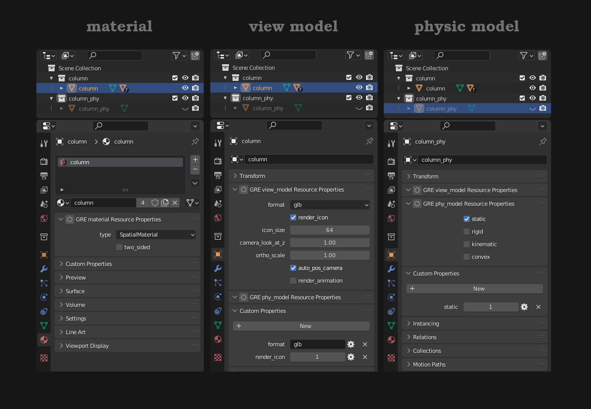
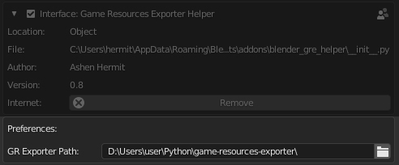

# BLENDER ADDON - Game Resources Exporter Helper
### For Blender 3.1+ 

## Features
* Reads [Game Res Exporter](https://github.com/AshenHermit/game-resources-exporter) code related to blender export, reads properties and classes documentation.
* Checks active plugins in your *GR exporter* config.
* Provides panels with available properties of view models, physic models, materials and other.
* Syncs with *custom properties*.

## How to make it work
* Just specify a path to your [Game Res Exporter](https://github.com/AshenHermit/game-resources-exporter) in preferences and restart blender.  
